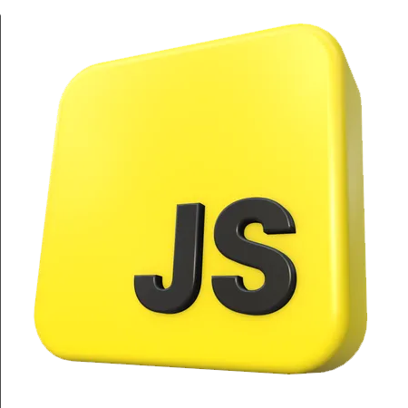
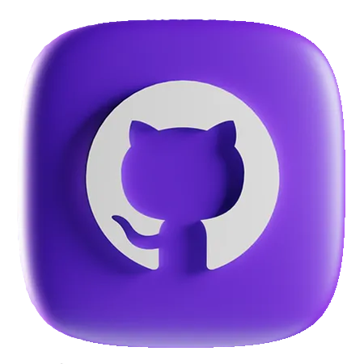
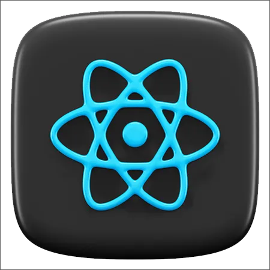
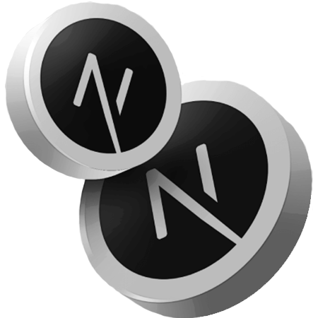
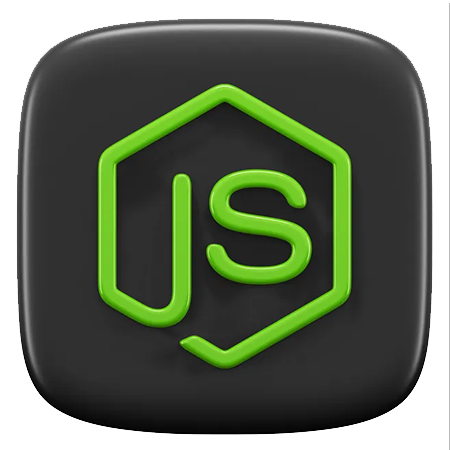
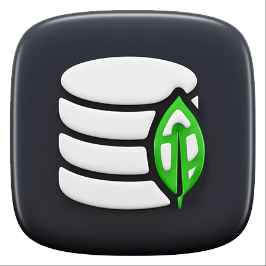
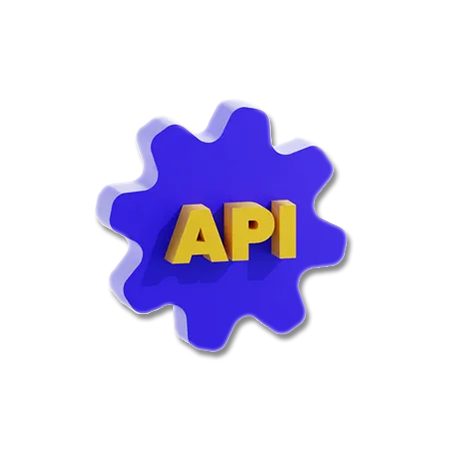

# Bem-vindo ao perfil de [José Sousa](https://www.linkedin.com/in/enoque-sousa-bb89aa168/) 😃️

## Sobre Mim
Sou um desenvolvedor Full Stack apaixonado por criar soluções inovadoras e eficientes. Com experiência em diversas tecnologias web, estou sempre em busca de novos desafios e oportunidades para aprender e crescer profissionalmente.

---

## Educação
- **Engenharia da Computação (Cursando)** - *FMU* 🎓
- **Alura Cursos** - *Diversos cursos concluídos em `Desenvolvimento Web` e mais* 🎓

---

## Experiência Profissional
- **Analista de Automação de Processos PL na Positivo Tecnologia S.A. (01/2024 - Atual)**
  - Experiência com tecnologias web como **`HTML`**, **`CSS3`**, **`React`**, **`Node.js`**, **`JavaScript`**, **`Next.js`** e **`TypeScript`**.
  - Profundo conhecimento em bancos de dados **`PostgreSQL`**, **`MySQL`** e **`MongoDB`**.
  - Habilidades em linguagens como **`Python`** e **`JSON`**.
  - Utilização de **`ChatGPT`** para otimização de processos e aumento de eficiência.

- **Tecnocomp Tecnologia e Serviços (07/2022 - 01/2024)**
  - Iniciei como estagiário N1 e, após 4 meses, fui promovido a Técnico de Suporte N2.
  - Criação de processos inovadores para solucionar e documentar novos problemas.

---

## Projetos

- **[Base dados IMC](https://base-dados-imc.vercel.app/index.html):** 
  - *Meu primeiro projeto desenvolvido com **`HTML5`**, **`CSS3`** e **`JavaScript`**. Ele foi criado para atender a uma necessidade específica e representou uma excelente oportunidade de aprendizado.*

 

- **[ES Data Base](https://esdatabase.vercel.app/login):** 
  - *Este projeto é uma evolução do meu primeiro trabalho, criado para servir como uma base de dados robusta e segura. Devido à natureza sensível das informações, implementei várias camadas de segurança, garantindo que apenas funcionários autorizados tenham acesso aos dados. As tecnologias utilizadas abrangem tanto o front-end quanto o back-end, incluindo **`Next.js`**, **`NextAuth.js`**, **`React`**, **`React Toastify`**, **`Material-UI`**, **`CSS Modules`**, **`Axios`**, **`DOMPurify`**, **`Styled Components`**, **`Vercel`**, **`Google OAuth`**, **`Microsoft Azure AD`**, **`HTML5`**, **`CSS3`**, **`JavaScript`**, **`JSON`**, **`PostgreSQL`**, **`Node.js`**, **`Express.js`** e **`CORS`**. Desenvolvi este projeto integralmente, desde a criação do banco de dados até a interface do usuário, agregando valor à minha equipe por meio de uma solução completa e bem estruturada.*

 

- **[Projeto 3](link-do-repositorio):** 
  - *Descrição em breve.*

 

## Tecnologias e Ferramentas

  
  
  
  
  
  
  
  
  
  
  
  
  
  
  
  
  
  
  
  

---

## Estatísticas do GitHub

 

  
  

---

## Contato

  
  

---

---

---
